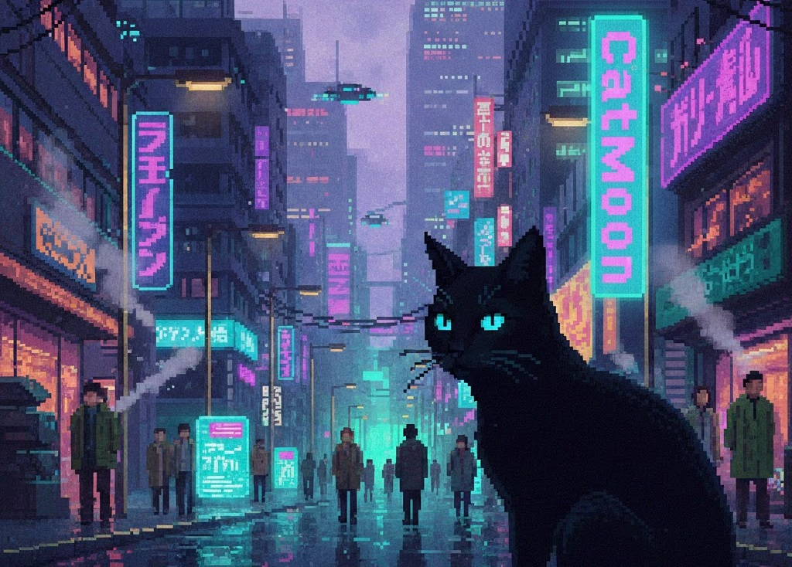

# Welcome to My GitHub Profile! 👋

　　　　　　

## 🚀 About Me
- 💻 Full Stack Developer
- 👯 Looking to collaborate on web projects
- 📫 How to reach me: shota.yamawaki@gmail.com

## 🏆 Achievements
- **EcoNavi App** (Jan 2026): Selected as a finalist in the Nihon University Business Contest.

## 💼 Marketplace / Sales
Check out my latest maps, builds, and resources on these platforms:

* **BuiltByBit**: [Visit My Store Profile](https://builtbybit.com/creators/catmoon.647372/)
    * 🏰 **Exclusive Builds:** Spawns, Hubs, and custom Maps.
    * ⚙️ **Technical Resources:** Plugins, configurations, and assets.
    
## 🌱 Projects I'm Working On
- Look at the repositories

## 📅 Future Plans
- Android: Release on Google Play.
- IOS: Release on Apple Store.

## 🛠️ Tech Stack

  
  
  
  
  
  
  
  
  

## 🚧 Work in Progress: My Company
**Sneak peek of my future headquarters!**

## 🌱 Learning 

　

