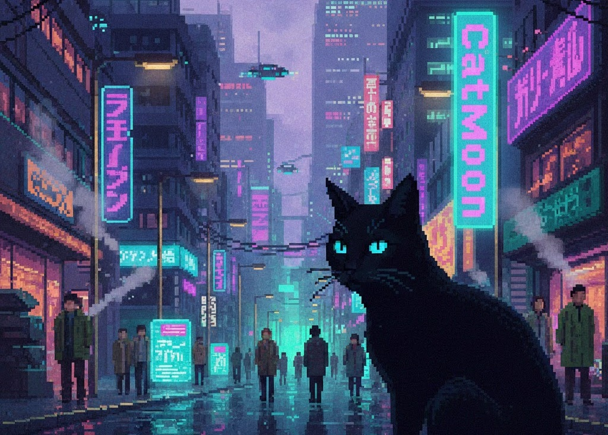

<div align="center">


</div>

<div align="center">


</div>


<div align="center">



</div>


## ░▒▓ NEURAL.PROFILE ▓▒░

```
> LOADING PROFILE DATA........  [OK]
> IDENTITY   : CatMoon
> CLASS      : Full Stack Developer
> STATUS     : ONLINE
> ENCRYPTION : ENABLED
```

- 💻 **Full Stack Developer**
- 👯 Looking to collaborate on web projects
- 📫 `shota.yamawaki@gmail.com`


## ░▒▓ ACHIEVEMENT.LOG ▓▒░

> `[2026.01]` ⚡ **EcoNavi App** — Finalist @ Nihon University Business Contest


## ░▒▓ MARKETPLACE.LINK ▓▒░

```
> ACCESSING SECURE MARKETPLACE NODE...
```

* **BuiltByBit** → [Visit My Store Profile](https://builtbybit.com/creators/catmoon.647372/)
    * 🏰 **Exclusive Builds:** Spawns, Hubs, and custom Maps.
    * ⚙️ **Technical Resources:** Plugins, configurations, and assets.


## ░▒▓ ACTIVE.PROGRAMS ▓▒░

```
> SCANNING REPOSITORIES...  [IN PROGRESS]
```

- `[*]` Look at the repositories


## ░▒▓ FUTURE.DEPLOY ▓▒░

```
> SCHEDULED UPLINKS:
  [ANDROID]  → Release on Google Play
  [IOS]      → Release on App Store
```


## ░▒▓ TECH.STACK ▓▒░

<p align="center">
  
  
  
  
  
  
  
  
  
</p>


## ░▒▓ CORP.HQ.PREVIEW ▓▒░

```
> INITIALIZING HOLOGRAPHIC DISPLAY...
```

<div align="center">


</div>


## ░▒▓ SKILL.MODULES ▓▒░

<div align="center">


</div>


## ░▒▓ LANGUAGE.MATRIX ▓▒░

<div align="center">


</div>


## ░▒▓ CONTRIBUTION.GRID ▓▒░

<div align="center">


</div>

<div align="center">


</div>
