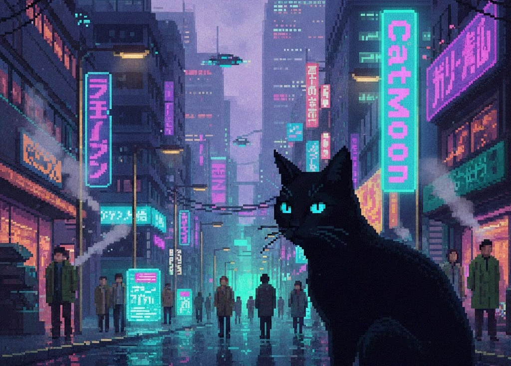

# Welcome to My GitHub Profile! 👋

　　　　　　

  <table style="border: none; border-collapse: collapse;">
    <tr style="border: none;">
      <td align="center" style="border: none; padding: 10px;">
        
      </td>
      <td align="center" style="border: none; padding: 10px;">
        
      </td>
    </tr>
  </table>

  <h3>🕒 CatMoon Bar Opening Hours</h3>
  
  **Weekdays (Mon - Fri)**: 18:00 - 24:00 (Night shift bartender 🌃)
   
  **Weekends (Sat - Sun)**: 10:00 - 22:00 (Always at the bar ☀️)
   
  **Closed**: When all bugs are resolved (Practically open every day 🧪)
   
  **Orders (Contact)**: shota.yamawaki@gmail.com (Or check the SNS badges below 🚪)

 

## 🚀 About Me
- 💻 Full Stack Developer
- 👯 Looking to collaborate on web projects
- 🧠 Active in Machine Learning & neural networks
- 📫 How to reach me: shota.yamawaki@gmail.com
- 🔗 Portfolio (Apps): [shota-devlog.web.app](https://shota-devlog.web.app/)

## 🌱 Projects I'm Working On
- 🧠 Machine Learning & Neural Networks projects
- And other repositories listed below!

　

